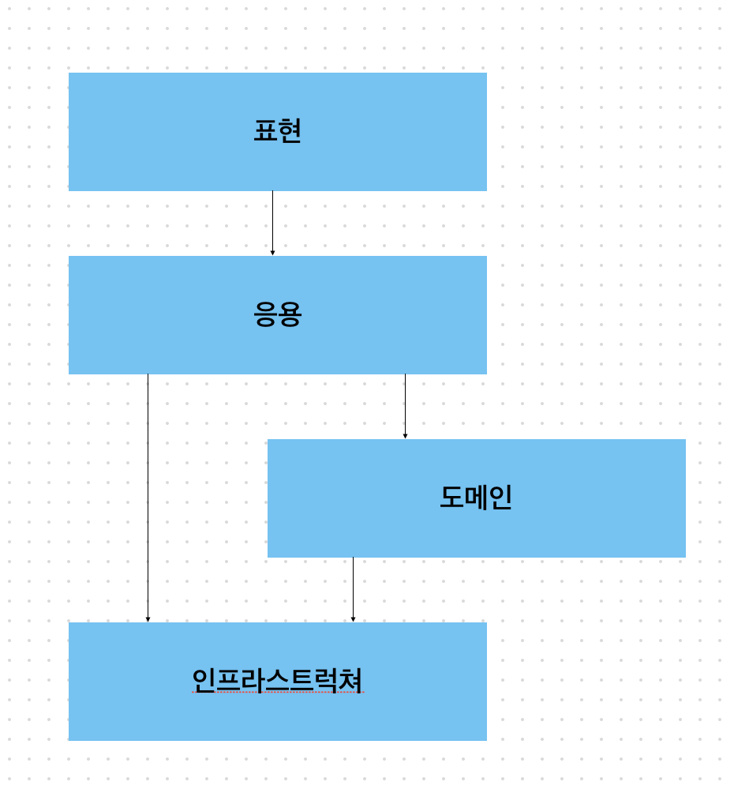

# 아키텍쳐

## 네 개의 영역

- 표현 (Presentation)
- 응용 (Application)
- 도메인 (Domain)
- 인프라스트럭쳐 (Infrastructure)

표현 영역은 HTTP요청을 응용 영역이 필요로 하는 형식으로 변환해서 전달하고 응용 영역의 응답을 HTTP응답으로 변환하여 전송한다.
표현 영역을 통해 주문 관련 기능을 제공하는 응용 서비스를 예로 살펴보면 다음과 같다.

```ts
class OrderService {
  @Transactional()
  async cancel(orderId: string) {
    const order = await this.orderRepository.findById(orderId);
    if (!order) throw new Error("주문을 찾을 수 없습니다.");
    order.cancel();
    await this.orderRepository.save(order);
  }
}
```

응용서비스는 로직을 직접 수행하기보단 도메인 모델에 비즈니스 로직 수행을 위임한다.
도메인 모델에서 도메인의 핵심 로직을 구현한다.
인프라스트럭쳐 영역은 구현 기술에 대한 것을 다룬다.
예를들어 데이터베이스나 메시징 시스템과 같은 외부 시스템과의 연동을 처리한다.

## 계층 구조 아키텍쳐



계층 구조는 특성상 상위 계층에서 하위 계층으로의 의존만 존재하고 하위 계층은 상위 계층에 의존하지 않는다.
응용영역과 도메인 영역은 DB, 외부 시스템 연동을 위해 인프라스트럭쳐 영역의 기능을 사용하므로 인프라스트럭쳐 영역에 의존한다.

## DIP

```ts
@Service()
class CalculateDiscountService {
  @Inject() private ruleDiscounter: RuleDiscount;
  @Inject() private customerRepository: CustomerRepository;

  caculateDiscount(orderLines: OrderLine[], customerId: string) {
    const customer = this.customerRepository.findById(customerId);
    return this.ruleDiscounter.calculateDiscount(orderLines);
  }
}
```

여기서 ruleDiscounter가 어디에 의존하는지는 모르고 그냥 RuleDiscounter가 룰을 적용한다는 사실만 알 수 있다.

## 도메인 영역의 주요 구성요소

- 엔티티 (Entity)
  - 고유의 식별자를 갖는 객체, 자신의 라이프 사이클을 갖는다.
  - ex) Order
- 벨류 (Value)
  - 식별자를 갖지 않는 개체로 주로 개념적으로 하나인 값을 표현할 때 사용된다.
  - ex) Money
- 애그리거트 (Aggregate)
  - 관련된 객체를 하나의 군으로 묶은 것
  - ex) Order, OrderLine 등을 '주문' 애그리거트라고 할 수 있다.
- 레포지터리 (Repository)
  - 도메인 영속성을 처리한다.
- 서비스 (Domain Service)
  - 특정 엔티티에 속하지 않은 도메인 로직ㅇ르 제공한다.
  - 도메인 로직이 여러 엔티티와 밸류를 필요로 하면 도메인 서비스에서 로직을 구현한다.
